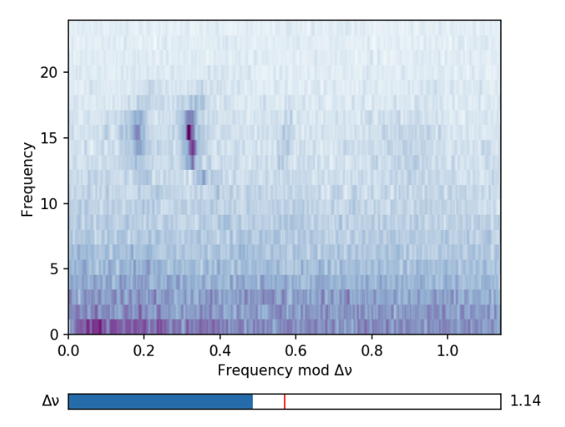

# Echelle

[](https://doi.org/10.5281/zenodo.3629933)

<!--  -->
Echelle is a Python package for plotting and interacting with echelle diagrams.
In an echelle diagram, the amplitude spectrum of a star is stacked in equal
slices of delta nu, the large separation. 

## Installation
`pip install echelle`
or download the git repository and 
`python setup.py install`

## Usage

For a dynamic interface:
```
from echelle import interact_echelle
interact_echelle(frequency, power, dnu_min, dnu_max)
```

If you're using echelle in a Jupyter notebook, I suggest calling `%matplotlib notebook` first.

To plot a non-interactive echelle diagram,
```
from echelle import plot_echelle
plot_echelle(frequency, power, dnu)
```

See the example.ipynb for common usage!

## Citing

If you make use of echelle in your work, please consider citing the Zenodo listing
```
@software{daniel_hey_2020_3629933,
  author       = {Daniel Hey and
                  Warrick Ball},
  title        = {{Echelle: Dynamic echelle diagrams for 
                   asteroseismology}},
  month        = jan,
  year         = 2020,
  publisher    = {Zenodo},
  version      = {1.4},
  doi          = {10.5281/zenodo.3629933},
  url          = {https://doi.org/10.5281/zenodo.3629933}
}
```
